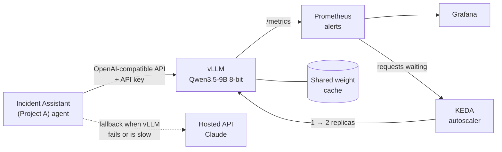

# Self-Hosted Model for the GPU Incident Assistant


**Should an AI assistant run on its own open model, or pay per use for a hosted one like Claude?
This project builds the self-hosted option end to end, measures it on real work, and answers
with numbers.**

## In 30 seconds

**The question.** The [Incident Assistant](https://github.com/joslo2345/incident-assistant)
uses an AI model to diagnose broken GPUs in a data center. A hosted model (an API you pay per
use) is simple. Running your own open model keeps data in-house and can be cheaper, but you pay
for a GPU server around the clock and have to operate it. Which is right, and when?

**What this project does.** It picks an open model, serves it the way production systems do,
deploys it to Kubernetes with autoscaling and monitoring, load-tests it with the assistant's real
conversations, plugs it into the assistant by changing configuration only, and tests what happens
when it fails mid-investigation.

**The answer.** The open model is accurate enough: it diagnosed **23 of 25** test incidents
correctly, slightly better than the assistant's original model. But a GPU costs the same per hour
whether it's busy or idle, so **a hosted model is cheaper below about 170 incidents a day**. Above
that, or when incident data must stay inside the company's cloud, self-hosting wins. Full
reasoning: **[recommendation memo](docs/RECOMMENDATION.md)**.

| What was measured | Result | In plain words |
| --- | :---: | --- |
| Correct root cause, 25 held-out incidents | **23/25 (92%)** | As good as the assistant's original model (22/25) |
| Citations backed by the evidence | **97%** | The model's sources really say what it claims |
| Unsafe recommendations | **0** | Never told anyone to take a healthy server offline |
| Switching the assistant to this model | **config only** | One settings file; no code change |
| Model killed mid-investigation | **4/4 finished** | A hosted model took over without repeating work |
| Autoscaling reaction | **44 s** to decide, **96 s** to a new replica | Notices a traffic spike and adds capacity on its own |
| Cost per incident at 20 a day | **$0.10** hosted vs **$0.84–$4.43** GPU | An always-on GPU is mostly idle at low volume |
| Break-even volume | **~170/day** (spot GPU) · **~900/day** (on demand) | Above this, running your own model is cheaper |

Every number comes from a reproducible run; details in [docs/RESULTS.md](docs/RESULTS.md), and
the reasoning behind each choice in [docs/DECISIONS.md](docs/DECISIONS.md).

**Where to read:** recruiters and hiring managers are done after this section and the
[recommendation memo](docs/RECOMMENDATION.md). Engineers can continue with the architecture and the
five work packages below.

## What this project demonstrates

| Area | What was built | Technologies |
| --- | --- | --- |
| **Model selection** | Three open models compared on the assistant's own test incidents; quantization and "thinking" mode measured | Qwen3.5-9B, Granite 4.2 8B, Gemma 4 E4B, MLX |
| **LLM serving** | OpenAI-compatible endpoint with tool calling, prefix caching and an API key | vLLM 0.30 (Apple GPU locally, CUDA image for NVIDIA) |
| **Kubernetes** | Hardened Helm chart: shared weight cache, startup probes, NetworkPolicy, no ingress | Helm, kind, Calico, Azure AKS (Terraform) |
| **Autoscaling and observability** | Scaling on the request queue, not CPU; dashboard and alerts as code with unit tests | KEDA, Prometheus, Grafana, promtool |
| **Performance and cost** | Load generator that replays real agent conversations; cost model and break-even | Python asyncio, Azure Retail Prices API |
| **Reliability** | Fallback that moves a live conversation to a hosted model when the local one fails | Provider abstraction in the assistant (Python) |

<details>
<summary><b>Glossary</b>: terms used below</summary>

| Term | Meaning |
| --- | --- |
| **Hosted model** | An AI model run by a provider (here Claude), paid per use through an API |
| **Self-hosted / open model** | A model whose weights you download and run on your own GPUs (here Qwen3.5-9B) |
| **vLLM** | Popular open-source server that runs open models efficiently and speaks the same API as OpenAI |
| **Tokens** | The pieces of text a model reads and writes; usage and cost are counted in tokens |
| **Quantization (8-bit, 4-bit)** | Storing a model's numbers with fewer bits: smaller and faster, sometimes less accurate |
| **TTFT** | Time to first token: how long before the model starts answering |
| **Prefix caching** | Reusing work for the part of a prompt the model has already seen, such as the conversation so far |
| **KEDA** | Kubernetes add-on that scales an app on any metric, here the number of requests waiting |
| **Spot GPU** | Spare cloud capacity at a deep discount that the provider can take back at short notice |
| **Break-even** | The daily volume at which self-hosting and the hosted API cost the same |
| **Fallback** | Switching to a backup model when the main one fails or is too slow |

</details>

## How it fits together



The two repos share no code. The assistant talks to any model over an OpenAI-compatible API, so the
same code runs on a hosted API, Ollama or this repo's vLLM, chosen by configuration. This repo
uses the assistant as its real workload: its 25 held-out test incidents for accuracy, and its
recorded conversations (`data/b4_traces.json`) for load. The assistant's side of the integration
(the fallback provider and the `values-selfhosted.yaml` Helm overlay) lives in
[its repo](https://github.com/joslo2345/incident-assistant).

**Constraint: $0 spend.** Everything ran on one laptop (Apple M3 Pro, 36 GB). The Azure GPU pool is
written and validated but was never applied; cloud costs come from Azure's published prices, and
the A100's throughput is an estimate (see [what isn't measured](#what-isnt-measured)).

## The five work packages

| Package | Question | Answer |
| --- | --- | --- |
| **B1** · Model selection | Which open model, at what precision? | Qwen3.5-9B, 8-bit, "thinking" off: 20/20 root causes on the first 20 incidents; thinking made every model worse and slower |
| **B2** · Kubernetes | Can it run like a production service? | Helm chart tested on kind; weight cache halves startup (65 s → 31 s); Azure A100 spot pool that scales to zero |
| **B3** · Autoscaling and monitoring | Does it scale on the right signal? | KEDA on queue depth reacts in 44 s; a new replica serves in 96 s; queued requests don't move, so size for the normal peak |
| **B4** · Load and cost | How much can one GPU do, and what does it cost? | Laptop saturates at 2 agents; prefix caching doubles throughput; break-even ~170/day (spot) |
| **B5** · Integration | Does the assistant work on it, and survive its failure? | Config-only switch; 23/25 correct; fallback finished 4/4 incidents after the model was killed |

## Quick start

Requires [uv](https://docs.astral.sh/uv/) and, for B1/B4/B5, an Apple Silicon Mac with about 24 GB
free for the model. Kubernetes steps need Docker, kind, kubectl and Helm.

```bash
make install    # Python dependencies
make check      # ruff, mypy --strict, pytest (there is no hosted CI: run before every push)
make engine     # once: pinned vLLM + vllm-metal in .venv-engine
make serve      # Qwen3.5-9B on 127.0.0.1:8100, thinking off
make smoke      # chat, streaming and tool-call checks against the endpoint
```

### B1 · Model selection

```bash
make serve CANDIDATE=granite THINK=true   # other shortlisted models, thinking on
scripts/compare_b1.sh                      # 20-incident comparison (needs Project A's stack up)
```

### B2 · Kubernetes

```bash
make deploy-check     # terraform fmt + validate, helm lint (no Azure access needed)
make kind-up          # local cluster with Calico, so NetworkPolicy is enforced
kubectl create namespace selfhost && kubectl create namespace ia
kubectl -n selfhost create secret generic vllm-api-key --from-literal=api-key="$(openssl rand -hex 24)"
helm install vllm deploy/helm/vllm -n selfhost -f deploy/helm/vllm/values-kind.yaml
make kind-check       # API key, NetworkPolicy and streaming checks
make cold-start       # pod-to-Ready time: empty cache, cached, cached + offline
```

On kind the chart uses vLLM's CPU image and a 0.8B stand-in model. On AKS: `terraform apply` in
`infra/azure`, install the NVIDIA device plugin (`deploy/gpu/`), then the chart with its defaults.

### B3 · Autoscaling and observability

```bash
make monitoring-up    # Prometheus + alert rules, Grafana + serving dashboard, KEDA
make rules-check      # promtool: alert rules and their unit tests
make grafana          # dashboard on http://127.0.0.1:3100
make spike            # spike test: TTFT, queue, replicas and alerts over time -> eval/b3/
```

Two vLLM replicas on kind need Docker Desktop's VM at 16 GB. Port-forwards listen on 127.0.0.1
only.

### B4 · Load test and cost

```bash
make bench    # fresh vLLM per config: baseline (1-64 agents), no prefix cache, 8k prefill (~1 h)
make cost     # cost per incident, break-even, charts -> eval/b4/cost.md, docs/img/
```

### B5 · Integration with the assistant

```bash
make b5-eval       # the assistant's full eval on the self-hosted model (~1 h; its stack up)
make b5-fallback   # kill vLLM mid-run; the agent must finish on the fallback model
make b5-report     # side-by-side results, hybrid analysis, cost by volume -> eval/b5/summary.md
```

## Repository layout

| Path | What's there |
| --- | --- |
| `src/selfhost/` | `smoke` checks, `spike` and `loadtest` generators, `cost` model (CLI: `uv run selfhost`) |
| `deploy/helm/vllm/` | vLLM chart: Deployment, KEDA ScaledObject, NetworkPolicy, weight cache PVC |
| `deploy/monitoring/` | Prometheus, Grafana and KEDA values; serving dashboard; alert rules and their tests |
| `deploy/kind/` | Local cluster config and the spike test's in-cluster proxy |
| `infra/azure/` | Terraform for the A100 spot node pool on the assistant's AKS cluster |
| `scripts/` | Benchmarks, evals, fallback test, report generators, trace export |
| `data/` | Recorded agent conversations and price inputs (with sources and dates) |
| `eval/` | Every report the numbers above come from |
| `docs/` | [Results](docs/RESULTS.md), [decisions](docs/DECISIONS.md), [recommendation memo](docs/RECOMMENDATION.md) |

## What isn't measured

Kept at $0 by choice, so a few numbers are estimates or missing, and the docs say so wherever they
appear:

- **The hosted model's own accuracy** on the 25 incidents: one run would cost about $3–4.
- **Throughput on a real A100**: estimated from published specs, calibrated on the laptop (±2x).
- **A real Azure deployment**: the Terraform and chart are validated, never applied, so GPU node
  start time (estimated 5–10 minutes) and scale-to-zero billing weren't observed.

## Documentation

- [Recommendation memo](docs/RECOMMENDATION.md): which option at what volume, data residency,
  operating burden, risks
- [Results](docs/RESULTS.md): every measured number, package by package
- [Decisions](docs/DECISIONS.md): what was chosen, what was rejected, and why
- [Incident Assistant](https://github.com/joslo2345/incident-assistant): the application this
  model serves, with its own [case study](https://github.com/joslo2345/incident-assistant/blob/main/docs/CASE_STUDY.md)
