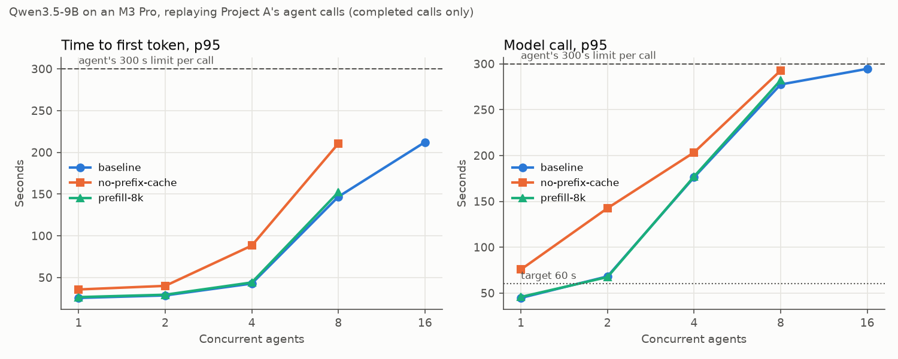
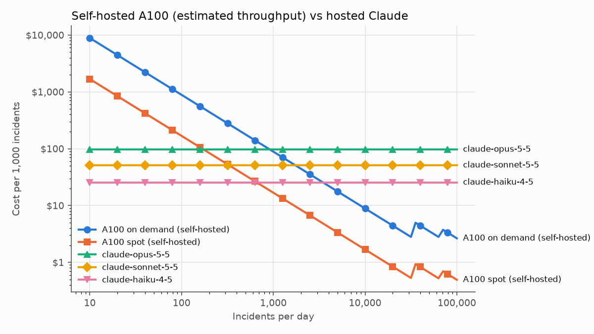

# Results

Every package records at least one measured number here. Hardware: Apple M3 Pro, 36 GB.

## B1 · Local serving smoke test (2026-10-02)

Engine: vLLM 0.30.0 + vllm-metal 0.30.0 (MLX, Apple GPU). Model: `mlx-community/Qwen3.5-9B-MLX-8bit`
at revision `84f7c2deea248d8df56240f88102def51c7ed5d6`, served with
`--tool-call-parser qwen3_coder --reasoning-parser qwen3 --max-model-len 32768`.

| Measure | Value |
| --- | --- |
| Weights on disk | 10.5 GB |
| Engine start to ready (warm cache) | ~55 s (engine init 20 s) |
| KV + state cache allocated | 15.05 GiB |
| Decode speed, one request | ~11 tokens/s |
| `make smoke`: chat / stream / tool call | PASS 19.1 s / PASS 15.1 s / PASS 64.6 s |
| "Reply with one word" request | 110 completion tokens, 106 of them reasoning |

Thinking mode is on by default and accounts for nearly all of the latency. The decode speed is
close to the memory-bandwidth limit for ~10 GB of weights on an M3 Pro (150 GB/s), so the
comparison runs have to control thinking. Quantization alone won't fix it.

## B1 · Shortlist smoke tests (2026-10-02)

Each model was served alone with `make serve CANDIDATE=...` (pinned revision, parsers per
docs/DECISIONS.md), then checked with `make smoke` and a one-word prompt. Engine and hardware are the same as above.

| | Qwen3.5-9B 8-bit | Granite 4.2 8B q8 | Gemma 4 E4B 8-bit |
| --- | --- | --- | --- |
| Weights | 10.5 GB | 9.3 GB | 8.9 GB |
| Start to ready (warm cache) | ~55 s | 23 s | 43 s |
| Smoke chat / stream / tool call | PASS 19.1 / 15.1 / 64.6 s | PASS 5.8 / 5.6 / 50.8 s | PASS 3.6 / 0.7 / 2.5 s |
| First tool chosen | `get_metrics` | `get_incident` | `get_incident` |
| Thinking by default | on | on | off |
| "ready" prompt: completion / reasoning tokens | 110 / 106 | 39 / 35 | 2 / 0 |
| Thinking can be turned off per request | (to test) | yes (`enable_thinking: false`) | yes (`enable_thinking: true` turns it on) |
| Decode speed, one request | ~11 tok/s (server log) | ~11.4 tok/s (server log) | ~16 tok/s (400-token answer, end to end) |

These are latency and tool-calling plumbing checks, not accuracy. Quality is measured by the
20-incident comparison against the A6 baseline. Qwen and Granite decode at the same speed
because both are memory-bandwidth bound at ~10 GB. Gemma's smaller per-token compute buys
~40% more speed. Its latency lead in the smoke tests mostly comes from not thinking by default.

## B1 · 20-incident comparison (2026-10-02)

Project A's eval harness (unchanged, commit `b26257a`) ran on the first 20 cases of its `test`
set against each shortlisted model, with thinking on and off. Only its provider settings pointed at
local vLLM (`scripts/compare_b1.sh`). The agent budget was Project A's default for every run,
including its 300 s limit per model call, and every model ran at a 32,768-token context like the
baseline. Citations were re-judged afterwards with the baseline's judge (`gemma3:12b`, prompt v2).
The baseline is Project A's `final-r3` test report restricted to the same 20 cases: Qwen3 30B-A3B
(`qwen3-agent`) on Ollama. Reports are in `eval/b1/`, and the table is `eval/b1/summary.json`.

| Model, thinking | Root cause | Action allowed | Fault left in service | Right runbook | Citation support | Latency p50 / p95 | Failed runs |
| --- | --- | --- | --- | --- | --- | --- | --- |
| **Qwen3.5-9B, off** | **20/20** | 17/20 | 1 | **18/20** | **99%** | 147 / 222 s | 0 |
| Granite 4.2 8B, off | **20/20** | 17/20 | 3 | 17/20 | 96% | **117 / 152 s** | 0 |
| Gemma 4 E4B, off | **20/20** | 16/20 | **0** | 16/20 | 96% | 121 / 262 s | 0 |
| Qwen3.5-9B, on | 18/20 | 16/20 | **0** | 15/20 | 93% | 214 / 382 s | 2 (timeout) |
| Granite 4.2 8B, on | 13/20 | 13/20 | **0** | 12/20 | 95% | 386 / 683 s | 7 (timeout) |
| Gemma 4 E4B, on | 17/20 | 15/20 | 1 | 13/20 | 90% | 198 / 351 s | 3 |
| *Baseline: Qwen3 30B-A3B, Ollama* | 18/20 | **18/20** | 1 | 16/20 | 92.5% | 122 / 213 s | 0 |

All runs cost $0 (local hardware). The 20 cases cover six fault types: pcie 3, thermal 3, ecc 4, gpu_off_bus 4,
nvlink 3, power 3. **They include no noisy-neighbor faults and no decoys**, so unsafe-action
rate isn't measured here.

Findings:
- **Thinking off is better for every model on this laptop.** At ~11 tokens/s a single thinking turn
  can pass the agent's 300 s per-call limit (all 9 Qwen and Granite failures). Gemma with thinking on
  also wrote two tool calls as plain text (`<tool_code`), which the parser can't extract, and one
  run went over the 32,768-token context. When Granite did finish with
  thinking on, all 13 answers were right, so thinking may pay off on a faster GPU (B2–B4).
- **All three models with thinking off beat the baseline on root cause** (20/20 vs 18/20) and on
  citation support, and are within one or two cases of it on actions.
- **The action misses differ by model.** Qwen's 3 misses: `replace_part` on two gpu_off_bus cases and
  `monitor` on one power fault. Granite's 3 misses all left a power fault in service (`monitor` or `none`).
  Gemma's 4 misses: `replace_part` on two NVLink cases, `reset_gpu`, and `escalate`.

## B1 · Quantization: Qwen3.5-9B at 4-bit, 8-bit and bf16 (2026-10-02)

The same 20 cases, the same harness and judge, thinking off. All three are the `mlx-community/Qwen3.5-9B-MLX-*`
conversions of one checkpoint (revisions pinned in the Makefile as `CANDIDATE=qwen4|qwen|qwenbf16`).
MLX quantizes weights with affine group-wise quantization (group size 64). The plan's AWQ and GPTQ
are CUDA formats that vllm-metal can't load, so this is the Apple-GPU equivalent.

| Precision | Weights | Root cause | Action allowed | Fault left in service | Right runbook | Citation support | Steps per case | Tokens per case | Latency p50 / p95 | Decode tok/s | Failed |
| --- | --- | --- | --- | --- | --- | --- | --- | --- | --- | --- | --- |
| 4-bit | **6.0 GB** | 17/20 | 14/20 | 0 | 15/20 | 97% | 9.2 | 110,566 | 168 / 278 s | **13.5** | 2 (context overflow) |
| **8-bit (chosen)** | 10.5 GB | **20/20** | 17/20 | 1 | **18/20** | **99%** | **4.3** | 40,084 | **147 / 222 s** | 11.6 | 0 |
| bf16 | 18.8 GB | **20/20** | **18/20** | **0** | **18/20** | 96% | **4.3** | **38,935** | 214 / 324 s | 7.2 | 0 |

Decode speed is the median of vLLM's 10-second throughput log while serving one request. Those windows include
some prompt processing, so read the speeds as relative rather than as peak decode. bf16 ran at
`GPU_MEM=0.7`, because at 0.6 vLLM computed a negative cache budget (-1.6 GB) and refused to start. The
other two ran at 0.6. Swap fell during the bf16 run (9.5 → 7.3 GB), so memory pressure didn't
affect its latency.

Findings:
- **4-bit breaks the agent loop.** It took twice as many steps (9.2 vs 4.3) and 2.8× the tokens.
  Two runs looped until they overflowed the 32k context, and it misread one gpu_off_bus fault as
  pcie_degradation. Its faster decode doesn't make up for the extra steps.
- **8-bit loses one action decision against bf16** (17 vs 18; a power fault left on `monitor`). It
  matches bf16 on root cause and runbook, uses 56% of the memory, and is 31% faster at p50.
- **bf16 is the most accurate run in B1.** It's also the only one to match the baseline's 18/20 on
  actions. On a GPU with memory to spare (B2), it's worth re-testing.

## B2 · Kubernetes deployment (2026-10-03)

The chart (`deploy/helm/vllm`) was tested on a local kind cluster with Calico, using vLLM's CPU
image (`vllm/vllm-openai-cpu:v0.30.0`) and `Qwen/Qwen3.5-0.8B` as a stand-in for the GPU model. The
AKS GPU pool (`infra/azure`) passes `terraform validate` against the azurerm 5.8 provider. Nothing
was applied in Azure ($0).

**Chart checks on kind** (`make kind-check`, all passing):

| Check | Result |
| --- | --- |
| `/health` without a key (used by the probes) | 200 |
| API without a key / with the key | 401 / 200 |
| From Project A's agent pod (namespace `ia`, `app.kubernetes.io/name=agent`) | allowed |
| From another pod in `ia`, or from a pod in vLLM's own namespace, with the key | blocked by NetworkPolicy |
| Streaming (protocol level) | 34 SSE chunks, then `[DONE]` |

**Cold start on kind**, from pod created to Ready (`make cold-start`, image already on the node):

| Start | Pod to Ready | Weight fetch (init container) |
| --- | --- | --- |
| Empty cache volume | 65 s | 21 s |
| Cached weights | 43 s | 1 s |
| Cached + `HF_HUB_OFFLINE` | **31 s** | 1 s |

The image pull added 30 s on first use (1.3 GB CPU image). The weight cache plus offline mode cut
startup by about half (65 → 31 s). The download share grows with model size: the 0.8B weights
(1.6 GB) took 21 s, about 80 MB/s. At that rate the GPU model's bf16 weights (19 GB) would take
about 4 minutes, which is the step the cache volume removes on every restart after the first.

Not measured, because doing so costs money: GPU node scale-up time, and model load time on an A100.
The plan's "time from node scale-up to first token" needs a real GPU node; B4 can measure it if
cloud credits are available.

Problems the kind test caught before any cloud run:
- **Service links broke vLLM.** A Service named `vllm` makes Kubernetes inject `VLLM_PORT=tcp://…`,
  which vLLM reads as its own setting and refuses to start. Fixed with `enableServiceLinks: false`.
  The GPU deployment would have failed the same way.
- **Download and load in one process ran out of memory.** On the first start vLLM downloaded and
  loaded the weights in the same process, and the memory peak OOM-killed it. Fixed with a
  `fetch-weights` init container that downloads to the cache volume first. Download retries no
  longer restart the engine, and the startup probe only has to cover loading.
- **The vision encoder was loaded for nothing.** Qwen3.5 loads it by default. The agent is text-only,
  so both value sets set `--limit-mm-per-prompt` to zero images and video.

## B3 · Spike test: queue-depth autoscaling on kind (2026-10-03)

Setup: the B2 chart on kind (CPU stand-in `Qwen/Qwen3.5-0.8B`, `--max-num-seqs=4`), Prometheus
scraping every 5 s, KEDA targeting 2 waiting requests per replica, min 1 and max 2 replicas.
`make spike` sent streaming requests of 64 tokens, open-loop and evenly spaced: 60 s at 0.05 req/s,
a 180 s spike at 0.4 req/s, then 120 s at 0.05 req/s. One replica serves about 0.22 req/s, so the
spike was about twice its capacity. Docker Desktop's VM has room for one vLLM pod only, so the
replica KEDA added stayed Pending, as it would while AKS looks for a spot GPU node. Full output:
`eval/b3/spike.md` and `.json`.

| Milestone, from the start of the spike | Time |
| --- | --- |
| Requests waiting above target (2) | +15 s |
| KEDA asks for a second replica (HPA desired = 2) | **+40 s** |
| Second pod created | +40 s (same sample) |
| Second pod Ready | never (no memory left on the node: Pending for 8 min) |
| Queue back to zero | +411 s |
| Scaled back to 1 replica | +535 s (queue empty + 120 s stabilization window) |

**Scale-up reaction: 40 s from spike to scale decision**, of which 25 s from crossing the target.
That gap is the 30 s queue average in the KEDA query, plus the 5 s scrape and the HPA's 15 s sync.
It's deliberate (one burst shouldn't add a GPU node), and small next to a GPU node's start time.

**What users saw while the new replica wasn't ready** (TTFT of requests sent in each window):

| Window | TTFT p50 | TTFT p95 | Max waiting |
| --- | --- | --- | --- |
| Before the spike | 3.2 s | 3.3 s | 0 |
| Spike, first 30 s | 13 s | 24 s | 4 |
| Spike, after 90 s | 112 s | 127 s | 24 |
| Spike, last 30 s | 185 s | 197 s | 36 |
| After the spike (load back to baseline) | 129–172 s | up to 205 s | 37 → 0 over 4 min |

- **No request failed (0 of 81), but they waited.** vLLM's queue has no limit: a request waits
  until a slot frees. TTFT grew by about 1 s for every second of the spike, and reached 205 s. That's
  close to Project A's 300 s limit per model call. A slightly longer spike would have turned
  waiting into agent timeouts.
- The queue took 4 minutes to drain after the spike ended. A replica that arrives late still helps
  with the backlog, as long as it arrives before the queue empties.
- **Alerts:** `VLLMTimeToFirstTokenHigh` fired at +254 s. On the CPU stand-in, TTFT was already
  above the 2 s GPU target before the spike, so the alert started pending then, and its timing says
  nothing about the GPU. `VLLMReplicaPending` didn't fire: the pod was Pending for 8 min, under the
  10 min threshold. All four rules are covered by promtool unit tests (`make rules-check`).
- **Server-side TTFT histograms overstate long waits:** the dashboard's p95 read 616 s, against a
  205 s maximum measured by the client. vLLM's top histogram buckets are wide, and
  `histogram_quantile` interpolates inside them. Use the client numbers for long tails; the
  histograms are fine at GPU-scale latencies.

**Estimated scale-up on AKS** (only the KEDA part is measured):

| Step | Time | Source |
| --- | --- | --- |
| Spike to scale decision | ~40 s | measured above |
| Spot GPU node joins the cluster | several minutes, or never if there is no spot capacity | not measured ($0) |
| vLLM CUDA image pull on a new node | 1–3 min (multi-GB image) | estimate |
| Weights from the shared cache, 19 GB at ~110 MiB/s | ~3 min | Azure's published file share limits |
| Model load + engine start | 31 s on kind's CPU stand-in (B2, cached + offline) | not measured on an A100 |

That's on the order of 5–10 minutes. At twice the capacity of one replica, the queue grows by
about one request every 5 s, and every request in it waits longer. So autoscaling covers sustained
growth, not sudden spikes. B4 and B5 should consider: enough minimum replicas for the normal peak;
a limit on vLLM's queue or the agent's concurrency, so overload fails fast instead of timing out at
300 s; and measuring real node-to-first-token time if cloud credits become available.

**Monitoring footprint on kind:** with the default Prometheus scrape jobs, the 7.75 GB VM swapped and
vLLM's engine hung on its first request until it restarted. With Prometheus limited to the jobs
B3 uses, the steady state is vLLM 5.6 GiB, Prometheus 95 MiB, Grafana 91 MiB, KEDA ~130 MiB.

## B4 · Load test and cost (2026-10-03)

**Workload:** Project A's agent, replayed from the 20 B1 runs of the chosen model (Qwen3.5-9B
8-bit, thinking off): 87 model calls, 4.35 per incident, 8,877 prompt and 338 output tokens per
call on average. Each incident is 96% prompt tokens, because every call re-sends the growing
conversation. Replayed prompts match the recorded token counts exactly. `make bench` runs it all
from one script: a fresh vLLM per configuration, 180 s per level, closed-loop agents, 300 s limit
per call. Full tables: `eval/b4/*.md`.

**Laptop (M3 Pro, one vLLM replica), measured:**

| Agents | TTFT p95 | Call p50 | Call p95 | Timeouts | Incidents/hour |
| --- | --- | --- | --- | --- | --- |
| 1 | 26 s | 24 s | 45 s | 0 | 32 |
| 2 | 29 s | 33 s | 68 s | 0 | **44** (peak) |
| 4 | 43 s | 82 s | 176 s | 0 | 36 |
| 8 | 147 s | 187 s | 278 s | 0 | 29 |
| 16 | 212 s | 274 s | 295 s | 5 of 16 | 30 |
| 32 | — | — | — | 32 of 32 | 0 (64 skipped) |

- **Saturation at 2 agents.** Throughput peaks at 44 incidents/hour, then falls while latency keeps
  rising. Only 1 agent meets the 60 s p95 target (32 incidents/hour). Per-call decode drops from
  13 tok/s alone to 5 tok/s at 8 agents. Above about 12 agents, a call waits more than 300 s even
  in steady state: one replica completes ~0.04 calls/s.
- Samples per level are small (7–16 calls in 180 s), so treat differences under ~15% as noise.

**Tuning changes:**

| Config | Within target | Peak | Effect |
| --- | --- | --- | --- |
| Baseline (prefix caching on, 2,048-token prefill chunks) | 32/h (1 agent) | 44/h (2) | |
| Prefix caching off | none (call p95 76 s at 1 agent) | 20/h (1) | **0.4–0.6x throughput**; timeouts from 8 agents |
| Prefill chunks of 8,192 tokens | 32/h (1) | 44/h (2) | no measurable change; slightly worse TTFT at 8 agents |

Prefix caching is the lever that matters for an agent: each call's prompt starts with the previous
call's whole conversation, so with caching only ~32% of prompt tokens need prefill (12,474 of
38,614 per incident). It's on by default; this shows what it's worth and why it must stay on.
Larger prefill chunks didn't help on vllm-metal; recheck on CUDA, where chunked prefill is tuned.

**A first measurement mistake, caught:** the first load generator started every agent at an
incident's first call. At high concurrency it measured mostly short first calls (84% at 64
agents) and reported 210 incidents/hour at 64 agents. With the call mix fixed, every call at 32
agents times out. The discarded numbers aren't committed; the test that prevents it is.

**Cost** (`make cost`, `eval/b4/cost.md`; prices retrieved 2026-10-03):

| Option | Cost per 1,000 incidents |
| --- | --- |
| Claude Opus 5.5 (prompt caching) | $97 ($156 if thinking triples output) |
| Claude Sonnet 5.5 | $51 ($81) |
| Claude Haiku 4.5 | $26 ($40) |
| A100 on demand, fully used (est. 1,473 incidents/hour) | $2.49 |
| A100 spot, fully used | $0.46 |

A GPU costs the same per hour at any volume: one always-on A100 is $88.68/day on demand or
$16.82/day spot, including the $16/month weight cache. So per-incident cost depends on volume:

| Break-even (incidents/day) | vs Opus 5.5 | vs Sonnet 5.5 | vs Haiku 4.5 |
| --- | --- | --- | --- |
| A100 on demand | 914 | 1,735 | 3,470 |
| A100 spot | 173 | 329 | 658 |

- **Below a few hundred incidents a day, hosted is cheaper**, and much simpler to run. A GPU fleet
  that raises tens of incidents a day pays $16.82–88.68/day for a GPU that's mostly idle, against
  a few dollars of API calls.
- **Self-hosting wins at volume:** one A100 (estimated ~35,000 incidents/day of capacity) costs
  10–200x less per incident than the hosted models when it's busy.
- **Spot only works with a fallback.** The break-even of 173/day assumes the spot node is always
  there. B3 showed users wait in the queue when a GPU node is missing, so a spot deployment needs
  the hosted API as fallback (Project A's provider switch) or an on-demand floor.
- **The A100 capacity is an estimate** (first principles, ±2x; DECISIONS). Even at half the
  estimate, break-even moves only within one replica's capacity (the fixed daily cost doesn't
  change), and the volume conclusions hold. The laptop measured 44 incidents/hour peak; the
  estimate is ~33x that; the A100 has 13x the memory bandwidth and far more compute.
- Hosted figures use Qwen's token counts and exclude Opus 5.5's thinking tokens (always on), so
  they're lower bounds. Quality differs too: B5 compares answers, not just cost.

## B5 · Project A on the self-hosted model (2026-10-03)

**Full A6 eval** (test set: 25 incidents, 7 failure types plus noisy neighbors, 3 decoys), Project
A's unchanged `main`, switched to vLLM by environment only (`make b5-eval`). Citations judged by
gemma3:12b with prompt v2, as in A6. Full report: `eval/b5/summary.md`.

| Metric | A6 baseline (qwen3 30B-A3B, Ollama) | Self-hosted (Qwen3.5-9B, vLLM) |
| --- | --- | --- |
| Root cause correct | 22/25 (88%) | **23/25 (92%)** |
| Action correct | **23/25 (92%)** | 20/25 (80%) |
| Unsafe action on decoys | 0/3 | 0/3 |
| Citations supported | 88% | **97%** |
| Runbook cited | 76% | 80% |
| Latency p50 / p95 | **125 / 287 s** | 158 / 390 s |
| Failed runs | 0 | 2 |
| Tool errors | 18 | **0** |

- The 9B model found more root causes, with better-supported citations and no tool errors, but
  chose the wrong action more often: `replace_part` instead of `drain_node` on two GPUs that fell
  off the bus, and `monitor` on a power fault (it left a faulty node in service). Project A's
  approval step for hardware actions matters more with this model.
- **Two runs failed**, both on long investigations: one submitted three malformed diagnoses
  (thermal runaway), one had a model call over the 300 s limit (noisy neighbor). Both are
  detectable, which is what the fallback and hybrid below build on.
- The hosted model's quality isn't measured ($0 decision); see the memo for what that leaves open.

**Fallback, tested by killing vLLM mid-run** (`make b5-fallback`, 4 incidents, Project A branch
`b5-fallback`, local Ollama `qwen3-agent` in the hosted API's place):

| Incident | Model per call (from the trace) | Result |
| --- | --- | --- |
| 1 (vLLM killed at 90 s) | qwen3.5-9b, qwen3.5-9b, **then qwen3-agent** | correct, 378 s |
| 2–4 | qwen3-agent only (primary refused, instantly) | all correct, 87–121 s |

The conversation moved mid-incident without repeating tool calls, and 4/4 incidents finished with
the right root cause. Incident 1 took 378 s instead of ~120 s because the stand-in had to load a
21 GB model from cold; a hosted API has no such load.

**Hybrid** (escalate to the hosted model when the self-hosted run fails or is unsure): both wrong
root causes were failed runs (confidence 0); every completed diagnosis reported 0.85–0.95 and was
right. So confidence adds nothing beyond "the run failed" on this set, and the useful rule is
simply: **escalate failed runs**. That sends 2 of 25 incidents (8%) to the hosted model, about
$0.008 per incident on average at Opus 5.5 prices, for a root-cause rate between 23/25 (if hosted
does no better) and 25/25. With 25 incidents and no confident mistakes, this can't show whether
confidence would catch subtler errors; the wrong actions above were all made with high confidence.

**Cost per incident by volume** (B4 model; A100 throughput estimated):

| Incidents/day | A100 on demand | A100 spot | Opus 5.5 |
| --- | --- | --- | --- |
| 20 | $4.43 | $0.84 | $0.10 |
| 100 | $0.89 | $0.17 | $0.10 |
| 1,000 | $0.09 | $0.02 | $0.10 |

## B3 follow-up · Full scale-up on kind with room for two replicas (2026-10-03)

Docker Desktop's VM raised from 7.75 to 16 GB, so the replica KEDA adds can start. Same spike as
B3 (60 s at 0.05, 180 s at 0.4, 120 s at 0.05 req/s). Two changes to the test so the new replica can
get traffic: requests go through an in-cluster proxy into vLLM's Service
(`deploy/kind/load-proxy.yaml`; `kubectl port-forward svc/vllm` pins every request to one pod), and
queue depth is read from Prometheus, summed over pods. Output: `eval/b3/spike.md`; the one-replica
run is kept as `eval/b3/spike-1replica.md`.

| Milestone, from the start of the spike | 1 replica fits (B3) | 2 replicas fit |
| --- | --- | --- |
| Requests waiting above target | +15 s | +17 s |
| KEDA asks for a second replica | +40 s | +44 s |
| Second pod Ready | never (Pending) | **+96 s** (52 s from created, weights from the shared cache) |
| Scaled back to 1 replica | +535 s | +527 s |
| Requests failed | 0 of 81 | 0 of 81 |
| Max requests waiting / TTFT p95 | 37 / 205 s | 39 / 206 s |

- **Scale-up works end to end: 96 s from spike to a second serving replica on kind**, made of
  44 s to decide (30 s queue average, scrape, HPA sync) and 52 s to start the pod.
- **The second replica served 19 of the 81 requests (24%), but users waited as long as before.**
  Two reasons. Both replicas run on this laptop's CPU, and vLLM's CPU backend pins each one to the
  same 11 cores, so the second replica splits the compute instead of adding to it. On GPU each
  replica has its own GPU; this part is a kind artifact.
- **Requests already queued stay where they are.** Each request is queued inside one vLLM pod, so
  the 20–30 requests waiting in the first replica when the second became Ready didn't move; only
  new arrivals went to the new pod. This holds on GPU too: a late replica helps new requests, not
  the backlog. It strengthens B3's conclusion: size the minimum replicas for the normal peak
  rather than rely on scale-up during a spike, and cap the queue (or the agent's concurrency) so
  a backlog can't build past what one replica clears within the 300 s call limit.
